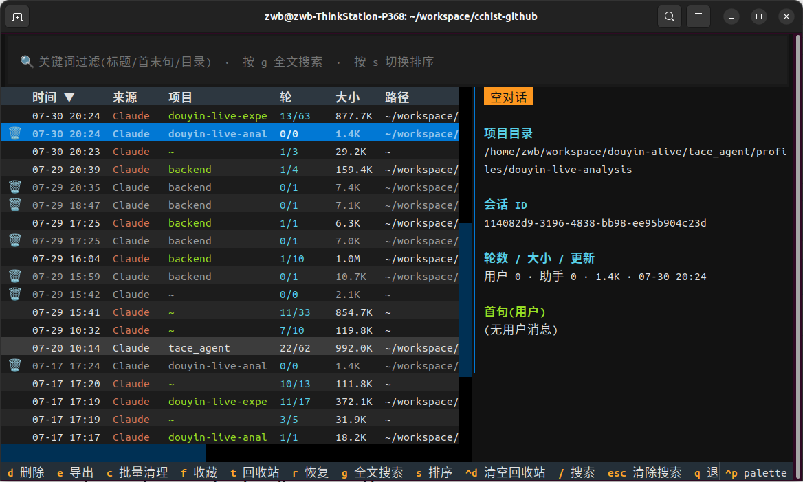
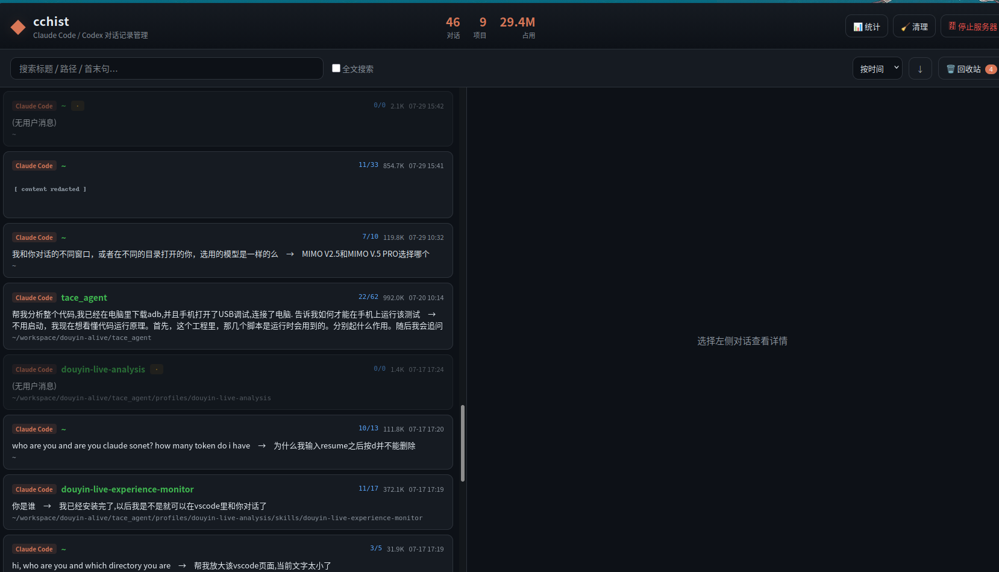

# cchist

  

> One place to browse, search and **resume** all your AI coding sessions —
> across Claude Code and Codex.

[中文说明 →](README.zh-CN.md)

Claude Code and Codex scatter every conversation into per-project folders
(`~/.claude/projects/…`, `~/.codex/sessions/…`). Over time they become
impossible to navigate: `--resume` only shows an auto-generated title, and the
sessions are spread across a dozen directories.

**cchist** flattens them all into one view. Search by title or full text, see
the first & last message and turn counts, jump back into any session (it `cd`s
to the original directory and resumes), and safely clean up throwaway chats.

Two frontends, one core:

- **Terminal TUI** (default) — keyboard-driven, press Enter to resume seamlessly
- **Web UI** (`cchist web`) — nicer to read long transcripts, export, and view stats

## Screenshots

| Terminal TUI | Web UI |
|---|---|
|  |  |

---

## Features

| | |
|---|---|
| 🔀 **Multi-agent** | Unifies **Claude Code** and **Codex** sessions in one list |
| 🗂 **Cross-project** | Every folder flattened into one view; sort by time / source / project / turns / size |
| 🔍 **Search** | Filter by title / path / first & last message, or full-text scan the transcript |
| ↩️ **Seamless resume** | Enter runs `claude --resume` / `codex resume` in the original directory |
| 🗑 **Safe delete** | Trash first (recoverable); empty & orphaned sessions auto-flagged |
| 🧹 **Batch cleanup** | Move all empty / orphaned sessions to trash at once |
| ⬇️ **Export** | Export any conversation to Markdown |
| 📊 **Stats** | Web overview: sessions-per-day trend and per-project breakdown |
| ⭐ **Favorites** | Star important sessions |
| 🌐 **Bilingual** | English / 中文 UI (auto-detected, or set `CCHIST_LANG`) |
| 🔧 **Portable** | Env-var overridable paths; Linux / macOS / Windows; Python 3.9+ |

---

## Install

```bash
pip install --user "cchist[web]"     # from PyPI, with the web UI
# or from source:
git clone https://github.com/Zephyrus704/cchist.git && cd cchist && pip install --user ".[web]"
```

> If `cchist: command not found`, add `~/.local/bin` to your PATH:
> `export PATH="$HOME/.local/bin:$PATH"`.

## Usage

```bash
cchist              # terminal UI (default)
cchist web          # web UI (opens the browser)
cchist web --port 9000 --no-browser
cchist --help
```

### TUI keys

| Key | Action |
|---|---|
| `↑/↓` | Move |
| `Enter` | Open (cd + resume) |
| `o` | Peek in the current terminal; back to the list on exit |
| `O` | Open in a new terminal window; cchist stays open |
| `/` | Focus search |
| `g` | Toggle full-text search |
| Click header / `s` | Sort by column; click again to reverse |
| `e` | Export selected to Markdown |
| `f` | Favorite / unfavorite |
| `d` | Delete (move to trash) |
| `c` | Batch-clean empty / orphaned |
| `t` | View trash |
| `r` | Restore from trash |
| `Ctrl+D` | Empty trash |
| `Ctrl+P` | Command palette |
| `q` | Quit |

### Web UI notes

`cchist web` starts a local server (default `http://127.0.0.1:8770`).

- **Stop it** from the terminal with `Ctrl+C`, or click **⏻ Stop server** in the
  top-right. ⚠️ Closing the browser tab does **not** stop the server.
- It binds to `127.0.0.1` only. Do not expose it with `--host 0.0.0.0`.

---

## How it works

Each tool stores sessions as JSONL with the working directory and every message:

- **Claude Code** — `~/.claude/projects/<slug>/<session-id>.jsonl`
- **Codex** — `~/.codex/sessions/YYYY/MM/DD/rollout-*.jsonl`

cchist only reads them. A small `Provider` abstraction (`providers.py`) knows
each tool's location, format and resume command; everything else (trash, search,
sort, export, UI) is provider-agnostic. Resume writes a signal file, then the CLI
wrapper `os.execvp`s into the real tool so the terminal is handed over cleanly.

cchist **never modifies** your conversation files — it only moves/deletes them,
and deletes go to a recoverable trash first.

Override storage locations with `CLAUDE_CONFIG_DIR` and `CODEX_HOME`.

## Project layout

```
src/cchist/
├── config.py      path config
├── providers.py   per-tool adapters (Claude, Codex)
├── core.py        data layer: scan / parse / search / trash / export (stdlib only)
├── resume.py      cross-platform resume
├── i18n.py        English / 中文 strings
├── tui.py         terminal UI (textual)
├── cli.py         CLI entry & subcommands
└── web/           FastAPI backend + build-free frontend
```

## Development

```bash
pip install ".[dev,web]"
pytest
```

## License

MIT
